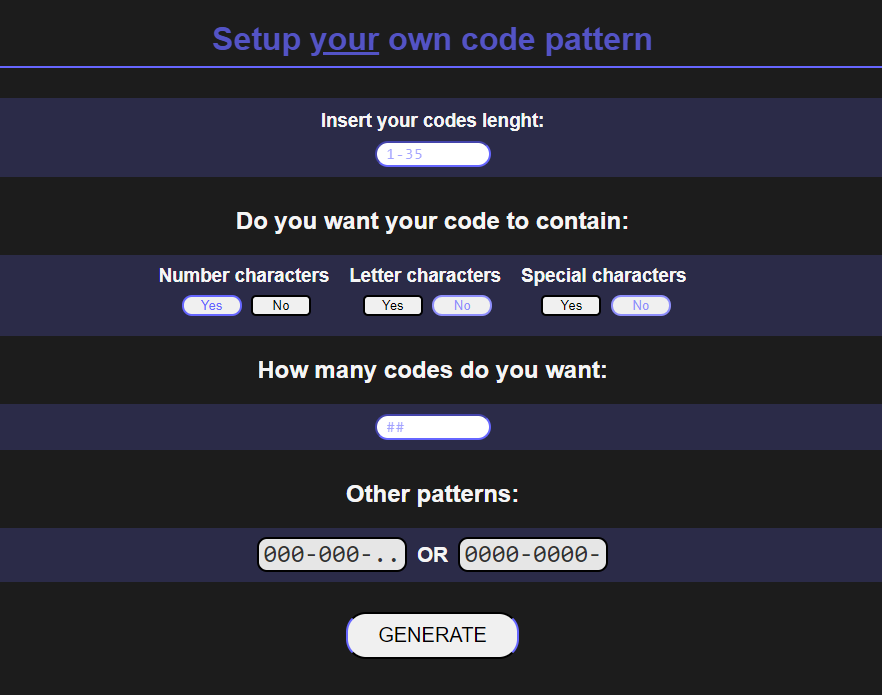
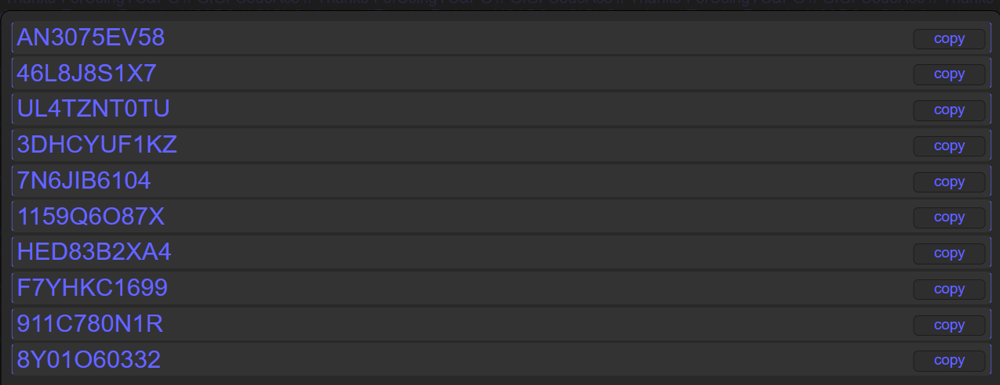
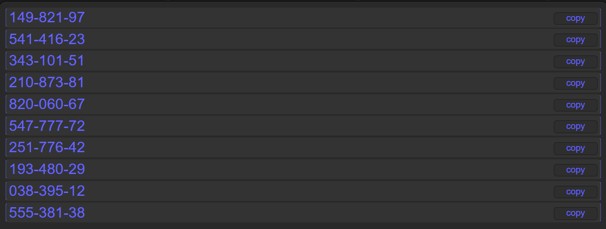
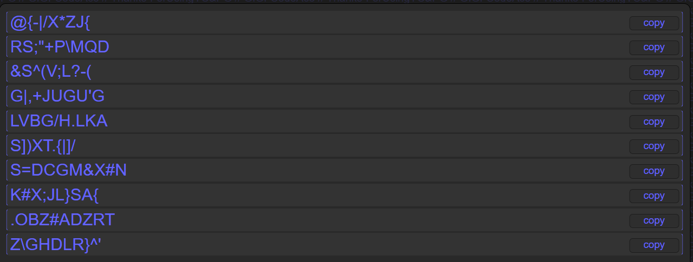

<h1 align="center" id="title">Your passwords and codes generator</h1>

<p align="center">
  
</p>

<p id="description">
YP & CG, your go-to website for customization in code creation.A platform where you have the freedom to craft specific code patterns for your numerous needs and create as many as you need.
</p>

<h2 align="center">Play here</h2>

<div align="center">
  <a href="https://gigi-codeace.github.io/YC-PG/CGmenu">github.io/YC-PG/Menu</a>
</div>

<h2 align="center">🧐 Features</h2>

<h4>Here're some of the project's best features</h4>

*   Choose code length and ammount to generate
*   Available numbers, letters, and special characters
*   Code templates with a characater every 3/4 char's
*   A part of the actual codes renderer:

```javascript
// ...
function Render() {
  let availableNums = [0, 1, 2];
  function cut(number){
    const indexToRemove = availableNums.indexOf(number);
    if (indexToRemove !== -1) {
      availableNums.splice(indexToRemove, 1);
    }
  }
  if (!specialsBN) {
    cut(2)
  }if (!charactersBN) {
    cut(1)
  }if (!numbersBN) {
    cut(0)
  }

  if (count < genQuan) {
    count++;
    let liContent = "";
    let temp = 0;

    for (let i = 0; i < charQuan; i++) {
      let randIndex = Math.floor(Math.random() * availableNums.length);
      let randomNum = availableNums[randIndex];

if (randomNum === 0) {
        liContent += Math.floor(Math.random() * 10);
      } else if (randomNum === 1) {
        liContent += getRandomItemFromArray(alphabet);
      } else {
        liContent += getRandomItemFromArray(specialCharacters);
      }

      if (tempSelected == 1) {
        temp++;
        if (temp % 3 === 0 && temp > 0) {
          liContent += joinType
        }
      }

      if (tempSelected == 2) {
        temp++;
          if (temp % 4 === 0 && temp > 0) {
            liContent += joinType
      
         }}

    }
        //...
  }}
// ...
```
<h2 align="center">Project Screenshots:</h2>
<div align="center">
<div>
<h3>Codes/passwords editor</h3>
  
</div>
<h3>Code generations</h3>
 
  
  
</div><br></br>

[](https://www.gigicodeace.com)
[](https://www.linkedin.com/in/dobre-robert-03653b331/)
[](https://github.com/GIGI-CodeAce)
[](https://cssbattle.dev/player/gigi)

  <b></b>
   <h4>~GIGI <code>Dore Robert</code></h4>
</footer>